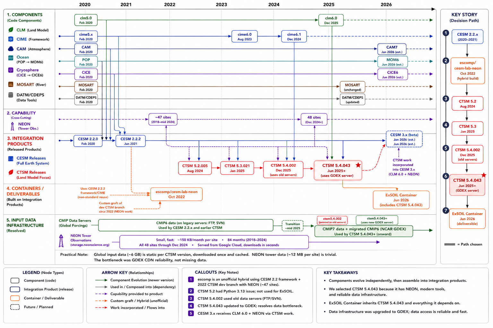

# Infrastructure Progress Report: ExSOIL Containerized Modeling Environment

**Period:** May-June 2026
**Project:** ExSOIL NSF Prototype
**Prepared by:** Steven Wangen, UW-Madison Data Science Institute

## Objectives

The ExSOIL project uses the Community Terrestrial Systems Model (CTSM)
to simulate soil processes at NEON ecological observatory sites across
the United States. Researchers run CTSM at specific tower locations,
feed the model observed atmospheric forcing data, and compare the
model's predictions of soil temperature, moisture, and carbon fluxes
against real measurements from the tower instruments. This
model-observation comparison is the foundation for evaluating and
improving CTSM's representation of soil biogeochemistry.

The project's computational environment is delivered as a Docker
container that packages CTSM, the NEON site workflow, and a Python
analysis stack into a single reproducible unit. Researchers pull the
container, launch JupyterLab, and work with model simulations and
observational data without installing or configuring any of the
underlying software.

The diagram below shows how the components, releases, and container
relate over time:

This reporting period focused on two infrastructure objectives:

1. **Multi-platform support.** The existing container only ran on
   Intel/AMD processors. Team members on Apple Silicon Macs (M1-M4)
   could not run the container reliably, limiting local development
   and testing.

2. **NEON workflow restoration.** The container's NEON tower site
   workflow had become non-functional due to version incompatibilities
   in the underlying CESM/CTSM model framework.

## Activities and Outcomes

### Multi-architecture container rebuild

The project's Docker container was rebuilt from scratch on a modern
foundation. The previous container was based on CentOS 8 (end-of-life
since December 2021), shipped Python 3.7 (end-of-life since June 2023),
and only produced Intel/AMD binaries.

The rebuilt container:

- **Runs natively on both Intel/AMD and Apple Silicon** (arm64)
  processors. Docker automatically selects the correct architecture
  when pulling the image. Team members on Apple Silicon Macs can now
  develop and test locally without the performance penalties and
  stability issues of processor emulation.

- **Uses Ubuntu 24.04 LTS** as the base operating system, with
  security support through 2029. This replaces CentOS 8, which has
  not received security patches since December 2021.

- **Installs all scientific libraries from conda-forge** pre-built
  binaries instead of compiling them from Fortran and C source code.
  This reduced container build time from approximately 45 minutes to
  5 minutes and eliminated a major source of architecture-specific
  build failures.

- **Pins exact package versions** via conda-lock for both processor
  architectures, ensuring that every team member gets identical
  software regardless of their hardware.

- **Upgrades to Python 3.13** and current versions of all scientific
  packages (xarray, cartopy, matplotlib, scipy, etc.), replacing
  versions that were 4-6 years old.

A 90-test automated validation suite was developed to verify the
container's functionality across three tiers: basic environment checks
(Python imports, compilers, libraries), CIME case management workflow
(creating and configuring CTSM cases), and full Fortran model
compilation with scientific analysis workflows (NetCDF I/O, cartopy
map rendering, xarray diagnostics). All 90 tests pass on native arm64.

### CTSM migration and NEON workflow restoration

During the rebuild, we discovered that the NEON tower site workflow
was non-functional. Investigation revealed that NEON support was never
part of any CESM 2.x release; it was developed exclusively for
standalone CTSM starting in February 2021 and will not enter CESM
until version 3.x (currently in beta, targeted for late 2026). The
previous container had worked around this by using a custom,
undocumented build that mixed component versions from different release
lines.

Based on this finding, we replaced the full CESM framework with
standalone CTSM 5.4, which is NCAR's intended platform for the NEON
workflow. This change:

- **Restored the NEON tower site workflow** with pre-configured
  settings for 48 NEON sites. Researchers can create and run
  single-point CLM simulations at any of these sites.

- **Reduced the container image size** by removing approximately 3-4 GB
  of source code for Earth system components the project does not use
  (atmosphere, ocean, sea ice, ice sheet, and wave models).

- **Aligned with NCAR's recommended approach** for NEON tower
  experiments, as documented in the official CTSM user guide and NCAR
  tutorial materials.

- **Removed the need for several workarounds** that had been applied to
  make CESM 2.2.2 compile with modern compilers, including PIO2 source
  patches, Python version pinning, and cmake version restrictions.

The trade-off is that the container no longer supports fully coupled
Earth system simulations (where the land surface interacts with a
simulated atmosphere, ocean, and ice). The project does not currently
use coupled simulations; all existing workflows run CLM in single-point
mode with observed atmospheric forcing. If coupled experiments are
needed in the future, a separate CESM 3.x container can be maintained
alongside the CTSM container.

### Input data resolution

The initial CTSM 5.4.002 release referenced input data files that
could not be downloaded from NCAR's public servers. Investigation
revealed that NCAR migrated their data infrastructure between the
5.4.002 release (December 2025) and the current development branch.
The data exists on NCAR's new GDEX server
(`osdf-data.gdex.ucar.edu`) but the 5.4.002 release shipped before
the configuration files were updated to point at the new server.

Upgrading to CTSM 5.4.043 (the current development tag) resolved
the server configuration. A pre-download script was developed to
handle remaining reliability issues with the GDEX CDN (a 3-hop
redirect chain that intermittently fails). The script downloads all
required input data (~6 GB of global data plus ~12 MB of NEON tower
forcing per site) with retries and server fallback, achieving 100%
success rate across 105 files.

The global input data is static per CTSM version and only needs to
be downloaded once. The NEON tower forcing data (150 KB/month per
site, available for 48 sites through December 2024) downloads in
seconds from Google Cloud Storage. Both categories are suitable for
caching on university infrastructure.

### Documentation

The rebuild, migration, and data resolution are documented through:

- **6 Architecture Decision Records** covering base image, build
  strategy, dependency management, distributed computing, CTSM
  migration, and CMIP era configuration
- **3 decision briefs** analyzing NEON compatibility options, CTSM
  version selection, and input data resolution (with a 12-step
  investigation trail)
- **A CTSM architecture guide** with diagrams explaining how CESM,
  CTSM, CLM, CIME, and NEON relate
- **A version lineage chart** showing component versions, releases,
  and data infrastructure across time
- **A technical rebuild report** for platform engineering review
- **A getting-started guide and introductory notebook** for new users
- **A roadmap** tracking completed work and planned next steps
- **A changelog** summarizing all additions, changes, and removals

## Challenges

The primary challenge was the gap between CESM's official release
versions and the NEON workflow's development timeline. The NEON tower
site functionality was developed on CTSM's master branch after the
CESM 2.2 release line had been cut, and will not be available in a
full CESM release until version 3.x ships. The previous container
masked this gap by using an undocumented custom build. Our rebuild
exposed the issue, which led to the architectural decision to move
to standalone CTSM.

A secondary challenge was achieving Fortran compilation on arm64 with
modern compiler and library versions. CESM 2.2.2's code required 13
compatibility fixes to compile with GCC 15 and conda-forge's
NetCDF libraries on ARM processors. Many of these became unnecessary
after the CTSM migration, which uses newer, more portable code.

A third challenge was resolving input data availability. The CTSM
5.4.002 release pointed at NCAR's old FTP/SVN data servers, but the
data for this release was published to their new GDEX server. This
was not documented in the release notes and was only discovered by
comparing the release tag to newer development tags. The GDEX CDN
also proved unreliable (intermittent failures on a 3-hop redirect
chain), requiring a pre-download script with retries and server
fallback.

## Next Steps

1. **End-to-end simulation validation.** A full KONZ transient
   simulation (pre-download, case.build, case.submit) is currently
   in progress. Success here validates the complete pipeline.

2. **Data caching strategy.** The ~6 GB of global input data should
   be cached (on university S3 or bundled in the container) to
   eliminate the slow download step for subsequent users.

3. **CI/CD test integration.** Wire the 90-test validation suite
   into the GitHub Actions workflow for automated testing on both
   architectures.

4. **Science notebook validation.** Connect the Modeling_Hub notebook
   to simulation output for model-data evaluation and calibration.
   Test Design_Hub and Data_Hub workflows end-to-end.
